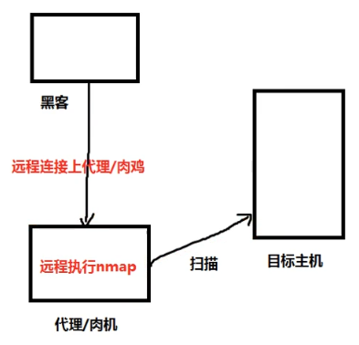
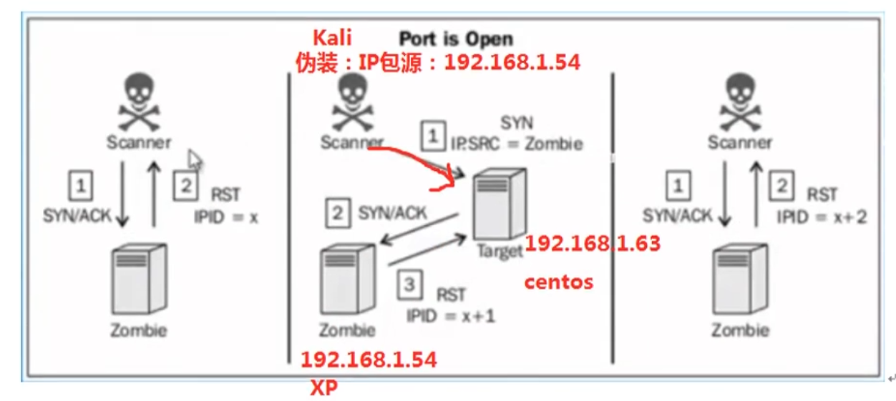
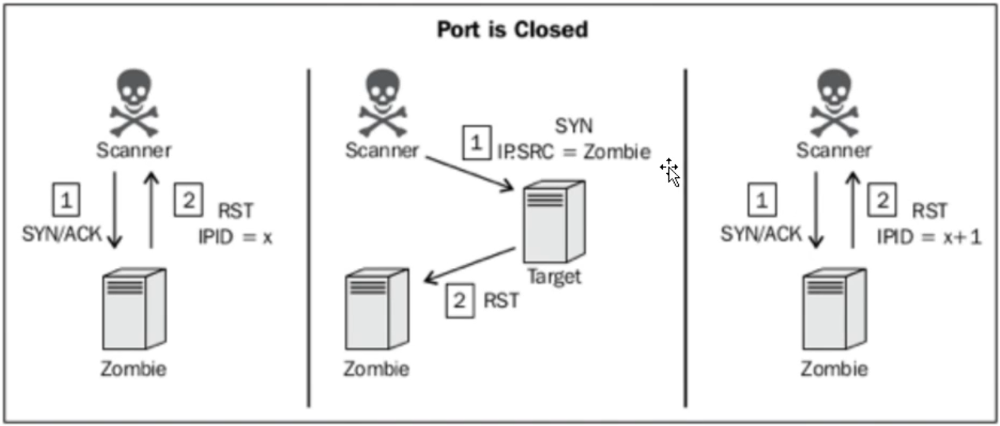

## 查找子域名

查找子域名:
比如 https://grs.cup.edu.cn/D/index.jhtml 是 https://cup.edu.cn/ 的子域名

1. 子域名挖掘机，meltego
2. 搜索引擎挖掘，google中输入 site:qq.com
3. 第三方网站查询: tool.chinaz.com/subdomain， dnsdumpster.com
4. 证书透明度公开日志枚举: crt.sh， censys.io
5. 其他途径: phpinfo.me/domain， dns.aizhan.com


## FOFA资产收集

`fofa.so`， 同类型的有 shodan

* 通过 title body country 等规则等搜索
* 通过网站的 icon 图标搜索(根据 icon_hash， 搜索出使用同一 icon 的网站)
* 通过 js 文件查询(使用同一个 js 路径。开源CMS统一漏洞)
* 通过 规则集 来搜索

## 被动信息收集

不发送数据，只接收


## 主动信息收集

发现目标主机过程

1. 识别存活主机
2. 
3. 通过 234 层


**基于 ping 命令**

* 查看经过的的网络设备 traceroute xuegod.cn

ping 延伸的命令，如 arping， fping， hping等

**使用 arping 命令**

* 内网协议
* arp协议: 发送前先根据 ip 地址查找 mac 地址， 并缓存起来

arp攻击: 冒充网关，使用 `arping 网关 -c 1` 查看是否有ip冲突

* arping 一次只能 ping 一个 ip
* 自动 ping 所有 ip. 使用 shell 脚本， 大致思路是通过 ifconfig 查找出 ip 和 mask， 然后 arping 所有主机

**使用 netdiscover**

主动方式: 容易被管理员发现， `netdiscover -i eth0 -r 192.168.1.1/24`

被动方式: 更隐蔽，嗅探， `netdiscover -p -i wlan0`

**使用 hping3**

* tcp/ip 数据包组装/分析工具，通常 web 服务会用来做压力测试使用，也可以进行 DOS 攻击实现
* 每个 hping 只能每次扫描一个目标.

`hping3 -h`

压力测试
```shell
hping3 -c 1000      数量
	-d 120     数据量
	-S	 只发送SYN包
	-w 64    window size
	-p 80    port
	--flood    洪水式
	--rand-source   出了路由器还是真实ip，内网内是伪造的ip
	xuegod.cn
```
该命令不要随意玩!!!

**使用 fping**

ping 的加强版本，可以扫描一个ip段

`fping 192.168.1.1/24 -c 1`

## 基于 Nmap 扫描方式

一般使用：`nmap -sn xx 主机扫描，不扫描端口`


* 半连接扫描(不会留下记录)
nmap `-sS` xueshen.cn -p 80，81，8080，22，21，443
* 全连接扫描(会被扫描机器留下记录)
默认全连接扫描，`不加 -sS`


## nc 扫描端口

很强大，俗称"瑞士军刀"


## 高级扫描：使用 Scapy 定制数据包

使用 python 写的 scapy

```python
ARY().display()		查看 ARP 数据包
###[ ARP ]###
  hwtype= 0x1				硬件类型
  ptype= IPv4				协议类型
  hwlen= None				硬件地址长度 MAC
  plen= None				协议地址长度 IP
  op= who-has				who-has 查询
  hwsrc= 00:0c:29:f3:0b:82	源 MAC 地址
  psrc= 192.168.217.134		源 IP 地址
  hwdst= 00:00:00:00:00:00	
  pdst= 0.0.0.0				向谁发送查询请求


>>> sr1(ARP(pdst="192.168.217.1"))		向指定主机发送 arp 请求数据包
Begin emission:
Finished sending 1 packets.
.*
Received 2 packets, got 1 answers, remaining 0 packets
<ARP  hwtype=0x1 ptype=IPv4 hwlen=6 plen=4 op=is-at hwsrc=00:50:56:c0:00:08 psrc=192.168.217.1 hwdst=00:0c:29:f3:0b:82 pdst=192.168.217.134 |<Padding  load='\x00\x00\x00\x00\x00\x00\x00\x00\x00\x00\x00\x00\x00\x00\x00\x00\x00\x00' |>>

```


**定制 ping**

`IP().display()`

```
>>> IP().display()
###[ IP ]###
  version= 4		版本 4，即 IPv4
  ihl= None			首部长度
  tos= 0x0			服务
  len= None			总长度
  id= 1				标识
  flags=			
  frag= 0			标志
  ttl= 64			生存时间
  proto= hopopt		传输控制协议，IPv6 逐跳选项
  chksum= None		首部校验和
  src= 127.0.0.1	源 IP
  dst= 127.0.0.1	目的 IP
  \options\
```


```
>>> ICMP().display()
###[ ICMP ]###
  type= echo-request	类型，标识 ICMP 报文的类型
  code= 0				代码
  chksum= None			校验和
  id= 0x0				标识
  seq= 0x0

```


IP() 生成 ping 包的源 ip 和目标 ip

ICMP() 生成 ping 包的类型。

使用 IP() 和 ICMP() 两个函数，生成 ping 包，进行探测。


```
>>> sr1(IP(dst="192.168.217.1")/ICMP(), timeout=1)
Begin emission:
Finished sending 1 packets.
..*
Received 3 packets, got 1 answers, remaining 0 packets
<IP  version=4 ihl=5 tos=0x0 len=28 id=62974 flags= frag=0 ttl=64 proto=icmp chksum=0x5109 src=192.168.217.1 dst=192.168.217.134 |<ICMP  type=echo-reply code=0 chksum=0xffff id=0x0 seq=0x0 |<Padding  load='\x00\x00\x00\x00\x00\x00\x00\x00\x00\x00\x00\x00\x00\x00\x00\x00\x00\x00' |>>>

```


**定制 tcp 数据包**


```
>>> TCP().display()
###[ TCP ]###
  sport= ftp_data		TCP 源端口
  dport= http			TCP 目的端口
  seq= 0				32 位序列号 seq
  ack= 0				32 位确认好 ack
  dataofs= None			4 位首部长度
  reserved= 0			保留 6 位
  flags= S				标志域，见①
  window= 8192			窗口大小
  chksum= None			16 位校验和
  urgptr= 0				优先指针
  options= []			选项

```

① 标志域：紧急标志`URG`、有意义的应答标志`ACK`、推`PSH`、重置连接标志`RST`、同步序列号标志`SYN`、完成发送数据标志`FIN`


```
>>> sr1(IP(dst="192.168.217.1")/TCP(flags="S", dport=80), timeout=1)
Begin emission:
Finished sending 1 packets.
....*
Received 5 packets, got 1 answers, remaining 0 packets
<IP  version=4 ihl=5 tos=0x0 len=44 id=3849 flags= frag=0 ttl=128 proto=tcp chksum=0xdc5c 
src=192.168.217.1 dst=192.168.217.134 
|<TCP  sport=http dport=ftp_data seq=385644656 ack=1 dataofs=6 reserved=0 flags=SA 
window=64240 chksum=0xbded urgptr=0 options=[('MSS', 1460)] |<Padding  load='\x00\x00' |>>>

```

收到 **SA** 包，说明端口开放


## 僵尸扫描


找僵尸主机。

1. 防火墙没有开
2. 闲置的，不向外发送数据包的
3. IPID 是自增的


使用僵尸机隐蔽自己

 


前提：可以不拿到肉机权限，只要对方的 IPID 是自增的就可以了


目标机端口开启：



1. 攻击者向僵尸机发送 SA 包，拿到 RST 包，获取其中的 **IPID**
2. 攻击者伪造僵尸机的 IP 向目标机发送 S 包，**若目标机端口打开**，会给僵尸机发送 SA 包，僵尸机发送 RST 包的同时 IPID 加一
3. 攻击者发送 SA 给僵尸机，拿到 RST 包，获取 IPID，**如果 IPID 增加了 2 则说明 目标机端口打开**


端口关闭的情况：



**IPID 只自增1**


> 如果僵尸主机不是闲置的，可能会发送其他的 IP 数据包，此时 IPID 自增可能超过 2


实战，使用 Scapy 操控僵尸主机进行 Dos 攻击

> rz1 = sr1(IP(dst="僵尸主机ip")/TCP(dport=445, flag="SA"))
>
> sr1(IP(dst="目标主机ip", src="僵尸主机ip")/TCP(dport=22, flag="SA"), timeout=1)    dport 目标主机的端口
>
> rz2 = sr1(IP(dst="僵尸主机ip")/TCP(dport=445, flag="SA"))
>
> 
>
> rz1.display()
>
> rz2.display()

条件比较苛刻，僵尸主机不能向外发送数据包


**使用 nmap 僵尸扫描**


找一个网段内可作为僵尸主机的机器，-p 指定端口范围

`nmap 192.168.1.0/24 -p1-1024 --script=ipidseq.nse`


使用僵尸主机扫描目标主机，指定扫描端口范围

`nmap + 目标主机ip + -sI + 僵尸主机ip + -p1-1024`


