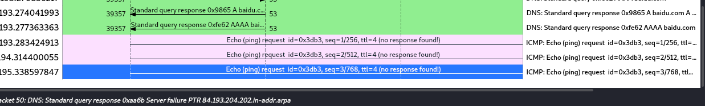

常见协议：

arp、icmp、tcp、http、ftp、https


**混杂模式**

混杂模式概述：混杂模式就是接收所有经过网卡的数据包，包括不是发给本机的包，即不验证 MAC
 地址。普通模式下网卡只接收发给本机的包（包括广播包）传递给上层程序，其它的包一律丢弃。

一般来说，混杂模式不会影响网卡的正常工作，多在网络监听工具上使用。


### 过滤器

**IP 筛选**

`ip.addr == 220.181.38.149` 筛选源 ip 或目的 ip

`ip.src_host == 192.168.1.53 or ip.dst_host == 192.168.1.1` 通过源主机 ip 或目的主机 ip 过滤数据包。使用逻辑运算符 **and** 、**or**、、


### 使用 wireshark 协议分析

过滤某个协议包时，会过滤出这个协议包以及他上层的协议包

**ARP**

地址解析协议

arp 请求数据包、响应数据包（request \ reply）

**ICMP**

基于 IP 协议

**TCP**

三次握手四次挥手

序列号 / 确认号、flags 标志位

**HTTP**


### 解决主机被黑上不了网


**修改 TTL 值为 1**：经过一个路由节点，TTL 减一，到 0 时不再进行转发

修改 TTL 的值

```shell
echo "2" > /proc/sys/net/ipv4/ip_default_ttl
```

抓包查看（ping百度，无响应）



**工具：mtr，查看沿途网络设备，以及网络质量**

```shell
apt install mtr
mtr baidu.com
```


